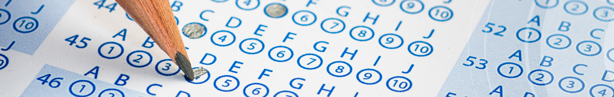
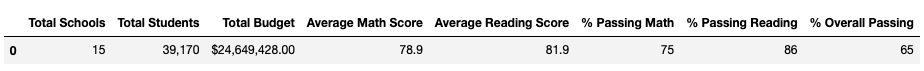
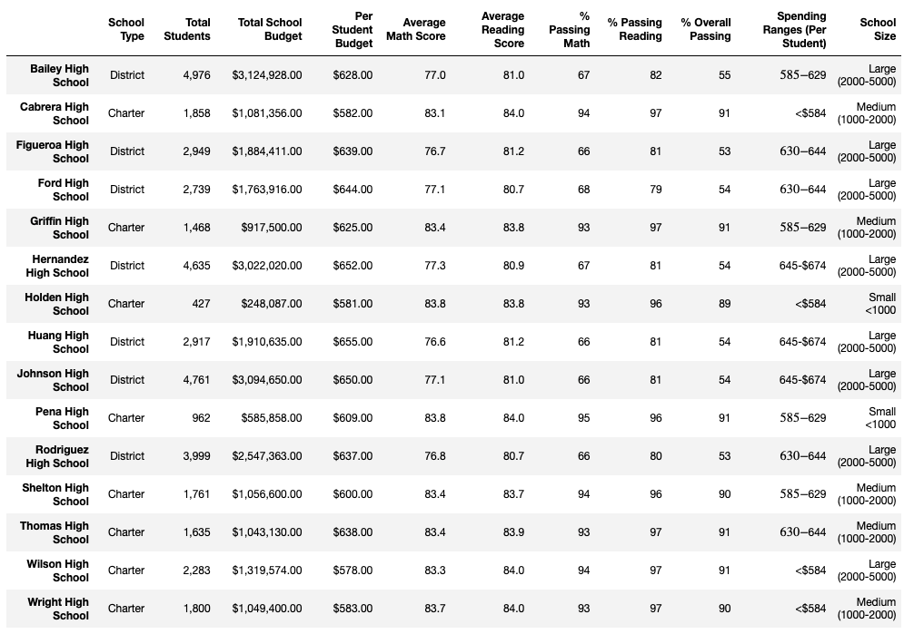
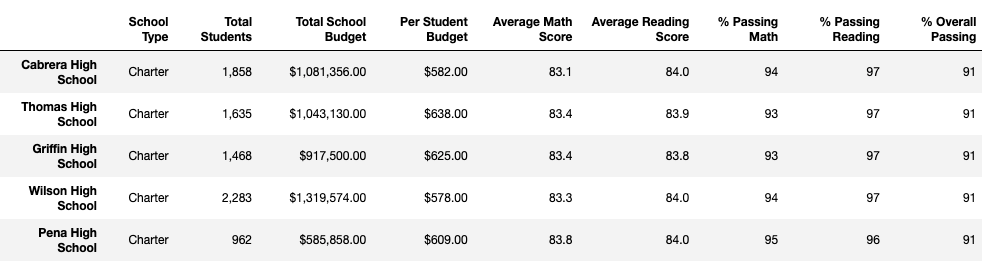
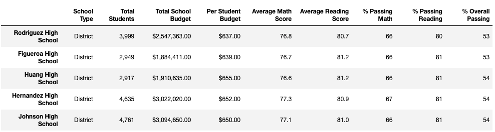
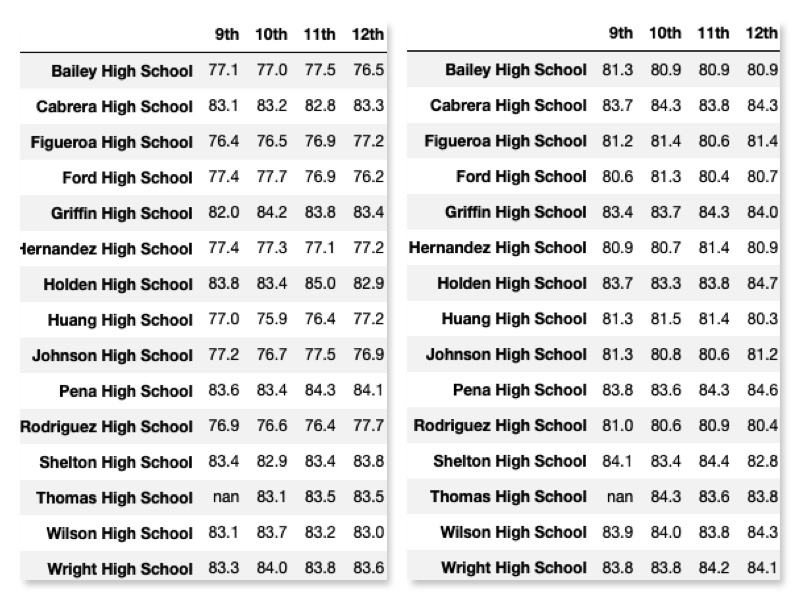
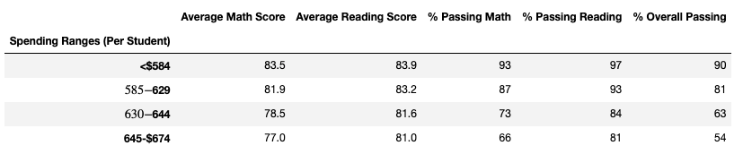
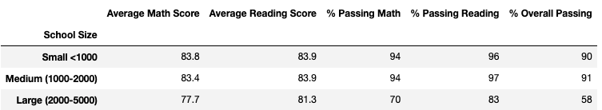
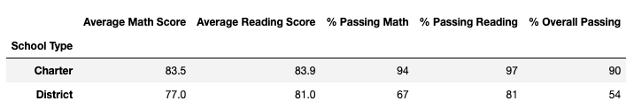

## School District Analysis

## Overview
Maria, the Chief Data Scientist of the City's School District, has tasked me to analyize data on the School District in the area high schools for their Standardized Testing, in these categories:
1.  Overall District Summary
  * Total Number of Schools
  * Total Number of Students
  * Total District Budget
  * Average Math Scores
  * Average Reading Scores
  * % Students Passing Math
  * % Students Passing Reading
  * % Students Passing Math & Reading
2. The second set of analysis, I will perform, on this data, is a breakdown of each of these categories:
  * Per School
  * Details of Thomas High School
  * Math and Reading Average Scores by Grade
  * Spending Summary (Schools Broken into groups by Budget per student)
  * Size Summary (Schools Broken into group by Number of students) 
  * Type Summary (Schools Categorized by Charter or District type school)
 
  * Show you the top 5 schools by their Avg Math and Reading Scores
  * Show you the bottom 5 schools by their Avg Math and Reading Scores
  * Show you the Avg Math and Avg Reading by School, by Grade

## Resources
* Data Source: schools_complete.csv, students_complete.csv
* Software: Python 3.7.10, Jupyter Notebook 6.3.0 

## Results
First, I will address, is the issue of Thomas High School's 9th Grade test scores.  All of my analysis has been done with Thomas High School's 9th grade's standardized test scores marked as NaN, in the charts you will see below.  In all mathmatical equations it is treated as zero.

Making all of the math and reading scores of entire grade of a medium sized school, will definitely make an impact. The School District isn't that small so the impact overall wasn't felt by the other schools.  With standard formatting and rounding rules, you would have to look a bit closer to see the difference, but it is there.  I will break it down in the individual areas.

### District Summary

#### How is the district summary affected by the change in data? 
_Answer:_ Removing the scores for the 9th grade reading and math, overall the District Summary faired very well, again with rounding to the tenth place you will hardly notice the change.  The first 4 areas wouldn't change, and the % Overall Passing was affected 1%.
* Average Math went down 0.07%
* Average Reading went down 0.03%
* % Passing Math went down 0.29%
* % Passing Reading went down 0.17%
* % Overall Passing went down 1.32%

### School Summary

#### How is the school summary affected by this change?
_Answer:_ The School Summary is a detailed breakdown, by school, of the District Summary, the changes are the same as above.  I will breakdown the changes of Thomas High School, and then the categories listed above, one by one.

### Thomas High School
#### How is Thomas High school affected by this change?
_Answer:_ Well obviously, Thomas High School was the most affected, but mainly it was their 9th graders, that will now present as not passing the Standardized Tests this year.  The School will also be affected in their ability to present well to the School Board in areas of improvement in Math, Reading and Overall Passing percentages.  Here is the official breakdown of the differences:
* Average Math went down 0.08%
* Average Reading went _**up**_ 0.06%
* % Passing Math went down 0.09%
* % Passing Reading went down 0.30%
* % Overall Passing went down 0.24%

### Top 5 Schools 

---
### Bottom 5 Schools

---

### Math and Reading Scores by Grade

#### How did changing the 9th Grades scores of Thomas High school affect the other schools Grades?
_Answer:_ When we look at each school and each grade, these averages were prepared individually.  We took each school separately, then the grades separately and calculated their averages in those students passing Math, in Reading, and then in passing both Math and Reading.  So no other school or grade was affected by removing the scores of Thomas High Schools 9th grade students.  Even the Thomas High Schools 10th, 11th and 12th graders were not impacted with these scores, as the 9th grade scores are not computed in these.

### Spending Summary

#### Difference in School Summary by Spending
_Answer:_ Thomas High School is in the _Spending Bucket_ of $630-$644, this is the bucket that saw the percentages of passing change, they are reflected below:
* Average Math went down 0.02%
* Average Reading went _**up**_ 0.01%
* % Passing Math went down 0.03%
* % Passing Reading went down 0.09%
* % Overall Passing went down 0.13%

### Size Summary

#### Difference in School Summary by Size 
_Answer:_ Thomas High School is in the _Size Category_ of Medium, this is the Category that saw the percentages of passing change, they are reflected below:
* Average Math went down 0.02%
* Average Reading went _**up**_ 0.01%
* % Passing Math went _**up**_ 0.02%
* % Passing Reading went down 0.06%
* % Overall Passing went down 0.07%

### Type Summary

#### Difference in School Summary by Type (Charter and District)
_Answer:_ Thomas High School is a _Charter School_, this is the Category that saw the percentages of passing change, they are reflected below:
* Average Math went down 0.01%
* Average Reading went up 0.01%
* % Passing Math went down 0.01%
* % Passing Reading went up 0.04%
* % Overall Passing went down 0.08%

## Summary
The City School District has performed well overall, each of the areas are performing well.  Despite the removal of Thomas High Schools 9th grade scores, the District performed pretty much the same.  When the 9th grade students of Thomas High School retake the Standardized Tests, we will rerun the analysis again and see how these numbers change.

The trends we want to point out to the District Superintendant and the School Board are as follows:

**District Summary**
The _Average Math and Average Reading_ scores are passing for the entire district, so that is something to be proud of, as well as the _% Passing Math and % Passing Reading_ for the district.  So on the whole, the students are doing well on the Standardized Testing provided by the State.

The _% Overall Passing_ is below 'Passing' at 65%, this will need to be an area that will need to be focused on, below are some trends that will help you narrow down the areas in need.

**Per School Summary Breakdown**
_**Your Top Performing High School is:  Wilson High School**_
* Wilson High School is categorized as a Small Budget, (<$584) per student, in the District, the only Large High School in this category.
* Wilson High School is categorized as a Large High School, in the District, the only Large High School with an % Overall Passing >70% (_theirs is 91%_)
* Wilson High School is categorized as a Charter School.

**School by Spending**
It is a curious trend on the School by Spending analysis, the schools that have the _highest_ amount of funds per student, are doing the worst! 
These schools have the lowest _Average Math Score_, which in turn gives them the lowest _% Passing Math_ and then the lowest _% Overall Passing_.  
* The highest amount spent on students, $645-$674, are the schools that are performing the worst, at **54%**. 
* We have 3 of our top performing schools with the Smallest budget per student, (<$584), _**Cabrera, Pena and Wilson High Schools at 91%**_.
* We have 2 of our top performing schools with the Medium budget per student, ($585-$629), _**Griffin and Thomas High Schools at 91%**_.

**School by Size**
We see another trend here, in which our _Largest Schools_ are suffering, and they too have the lowest _% Overall Passing Percentage_. With % Passing Math, at the very bottom of Passing. 
* The Largest Schools, are from 2,000-5,000 students, and have an % Overall Passing of **58%**.  
* Of all of the _Large_ High Schools, only one, has the % Overall Passing above 70%, _**Wilson High School at 91%**_.

**School by Type**
The last trend found, is that our _Charter Schools_ are outperforming our _District Schools_ but a large margin, _**23%!**_. This is the biggest cause of our _% Overall Passing Percentage_ dropping. 
* **Every** _District_ High Schools, % Overall Passing is **below** 56%.
* **Every** _Charter_ High Schools, % Overall Passing is **above** 89%. 
* We have a 5-way tie for first place, with an % Overall Passing above 70%. _**Cabrera, Griffin, Pena, Thomas and Wilson High Schools at 91%**_

Thank you for allowing me to perform this analysis for you. If you have any questions about this report, please let me know and I would be happy to answer them for you.
Jill Hughes
